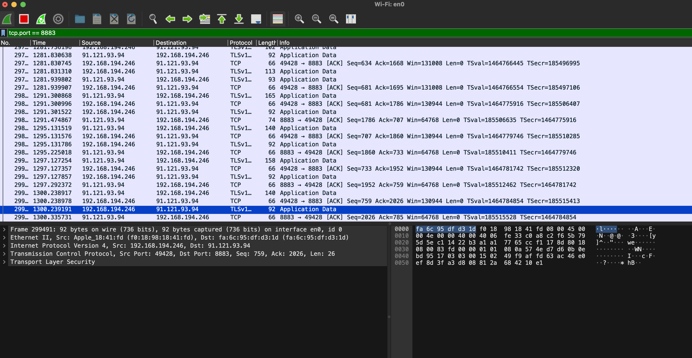

# Individual Project IoT

This repository contains the implementation for the individual project of the Internet of Thing - Algorithm and Services course held in Sapienza, academic year 2023-2024. 

## The assignment
The assignment is to create an IoT system that collects information from a sensor, analyses the data locally and communicates to a nearby server an aggregated value of the sensor readings. The IoT system adapts the sampling frequency in order to save energy and reduce communication overhead. The IoT device will be based on an ESP32 prototype board and the firmware will be developed using the FreeRTOS.
Assume the input signal is a sum of sinusoids.

## General Idea
The general idea to solve the assignment is 
- Start by sampling the signal at the maximum frequency of the device 
- Perform the FFT and find the maximum frequency of the signal
- Adapt the sampling rate to Nyquist frequency (aka the double of the frequency of the signal)
- Finally calculate the aggregate value of the signal and communicate it through MQTT

## How to Run the code

Run `idf.py build flash monitor` to build, flash and monitor the project into the ESP32 board. Before doing so make sure to put the right SSID and password of your WiFi connection in the ``fft/main/wifi/wifi.h`` file and change the certificates in the `certs` directory with your client key, client certificate and server certificate by following the indiciation at this link [mosquitto setup](https://test.mosquitto.org/ssl/). Then put all together in the `fft/main/mqtt/mqtt_mosquitto_io.pem` file in the order above (before all of these make sure to have moquitto installed [install mosquitto](https://medium.com/gravio-edge-iot-platform/how-to-set-up-a-mosquitto-mqtt-broker-securely-using-client-certificates-82b2aaaef9c8).

Meanwhile run also the `subscriber.py` python file that connects to the MQTT broker to be able to receive the messages sent by the board.

## Explanation of the code
### `fft.c`
This file contains the functions to calculate the FFT and to find the frequency of the signal. 
The FFT is calculated by passing to the function `dsps_fft2r_fc32` an array containing the signal to which is applied Hanning windowing in the real part, and containing 0 for the imaginary part since we are dealing with a real signal. The windowing is necessary because it isn't said that we sample an integer number of periods of the signal, without windowing FFT would find high frequency components not present in the original signal (this effect is called spectral leakage). Then the magnitude of the frequencies are calculated with the formula $\sqrt{real^2 + imaginary^2}$ .
The frequence of the signal is calculated exploiting the z-score. The z-score is a way to found outliers and the formula is $z = {(x - mean) \over standard deviation}$. So, the z-score is applied on all the bins resulting from the magnitude computation in the fft function. The frequence of the signal will be the right-most outlier in the array multiplied for the sample rate and divided for the number of samples. 

### `sensing.c`
This file contains the logic to sample the file. The idea was to sample an actual audio file, but I encountered some problems with the circuit (more details at the end of the README.md) so for now the initialization od the ADC is useless and the  signal is artificially generated by simulating the time t to calculate the value of the signal in the specific point and the taskDelay.
It is also present a function to remove the component at frequency 0 that could be present in the audio signal.

### `wifi.c`
This file contains the code to initialize and manage a WiFi connection. The connection is tried 5 times. There is an handler function that handles WiFi and IP events. While the other function initializes and sets up all the needed components.

### `mqtt.c`
In this file it is managed all the MQTTS connection. Since the connection is secure the private key of the client, the certificate of the client and the certificate of the server are needed; they're put together in  the `mqtt_mosquitto_io.pem` file and the signle files arein the `certs` directory. Also in this  case we have the handler which handles the different MQTT events, the start function that configures and initializes the connection and finally it is present a function that has the work to publish messages.

### `subscriber.py`
This is the Python code to subscribe to the topic to which the ESP32 will publish the messages to monitor, the paho-mqtt framework is used. In particular everytime a message is received, the timmestamp is printed in order to be able to do some statistics such as the end-to-end latency.

### `wave.py`
This file contains the code to generate the audio signal and play it.

## Results obtained
### Energy savings
In the laboratory is present a programmable DC power supply that I used to monitor the power. I fixed the voltage to 5V and supplied it to the ESP32. The device actually showed also the current and power that it was providing. The experiment was conducted in this way:
1. First I started by always sampling at an high frequency, without any FFT calculation.
2. Then I sampled continuously but with the adapted frequency. I did the experiment with 3 different signal frequencies
    - Signal frequency at 300 (order of hundreds)
    - Signal frequency at 40 (order of tens)
    - Signal frequency at 4 (order of units)

These are the results that I obtained:
| Frequency (Hz)      | Power consumption(W) | Saving (%) |
| ------------------- | -------------------- | ---------- |
| not adapted - 1000  | p1                   |   -        |
| adapted - 300       | p2                   |   bggb     |
| adapted - 40        | p3                   |  gbgbgbgb  |
| adapted - 4         | p4                   | bgbvgbgf   |

### Latency
The edge server that should receive the aggregated value in this case is my computer. To compute the latency from the point the data are generated up to the point they are received from my computer I made the ESP32 send an mqtt message when it starts to generate the signal and when it has computed the aggregated value. The python code that acts as a subscriber prints the timestamp at which it receives the messages. At this point it is sufficient to do a simple substraction to find out the latency required.
I measured the time both from python and from inside the code of the esp (following the images). In particular inside the ESP32 I printed the time in milliseconds both when I sent the packet and when I receive it (to do so I subscribed to the same topic in which I publish the messages). I measured a delay between 181 and 718 ms from the moment I send the message and the moment I receive it inside the ESP32. Considering the times at which I publish the messages (so the effective time that the ESP used to calculate the values) is 5,136 s (time window was of 5 s). Considering the times at which the ESP receives the messages I measure a time delay of 4,7 s, this is because the first message took longer. If I measure the delay in Python I have a latency of ~5,1 s and ~4 seconds in the two measurements that I made.
So, if I consider the real time the "I started sampling" message was sent and the time at which the "aggregated value is" message was received the end-to-end latency is of 5,427 s.

### Volume of data transmitted
The volume of data transmitted over the network is the same for both the oversampling case and the adapted sampling frequency. In fact in both cases we simply send an MQTT message when the aggregated value is computed, and the aggregated value is computer over a time window which is fixed. If instead we wanted to compute the aggregated value over a fixed number of samples, then in this case obviously the time spent to sample is different and in the case of the oversampled signal it will take less time and so more messages on the network in the long run. For example if I have a signal at frequency f=100 Hz (so I sample at 200 Hz), to take N=1024 samples it will take t = N * (1/(2\*f)) = 5,12 ms; while if I sample at 10000 Hz, t = N * (1/10000) = 0,1 ms. So in say 1 seconds 195 packets will be sent in the adjusted case and 9765 in the oversampled case.
But we are fixing the  time window on which to compute the  aggregated value, and so if for example the time window is  5 seconds, after 5 seconds + some latency we will have only 1 packet in both cases.
Now, the size of each packet is 92 B as shown in the figure (the packet of 140B and 156B are the other control messages that I send to know if I'm sampling at maximum rate or adjusted rate):

## Problems encountered and future development
I tried to take the signal directly from the jack cable from my PC. What I did is to take a pair of headphones with the cable and isolate the ground and one of the signal wire. At this point the problem is that from the signal wire we have also negative values that the ESP32 is  not able to read, so I built a circuit like  the one in the figure to be able to re-center the signal not on 0 but at 1600 mV (thanks to the 2 resistor). Then the idea was to generate an udio signal with the `wave.py` script and sample it. In doing so I encountered some problems, the signal is sampled and it seems to have an oscillation, but when I compute the FFT and then the magnitudes for the frequencies the z-scores are very low. I saw that there was an high frequency in 0 and so I also tried to remove it from code and the situation was somewhat better but not sufficient.

